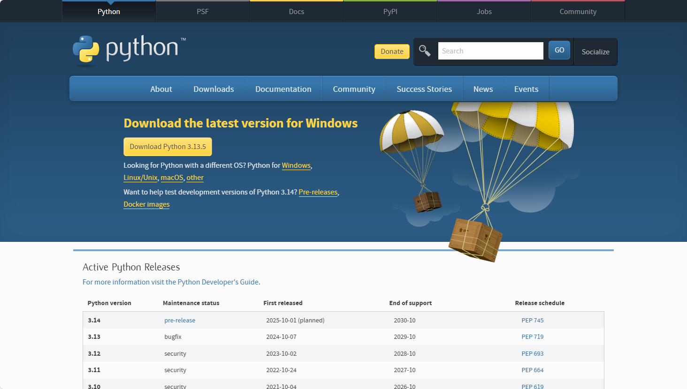
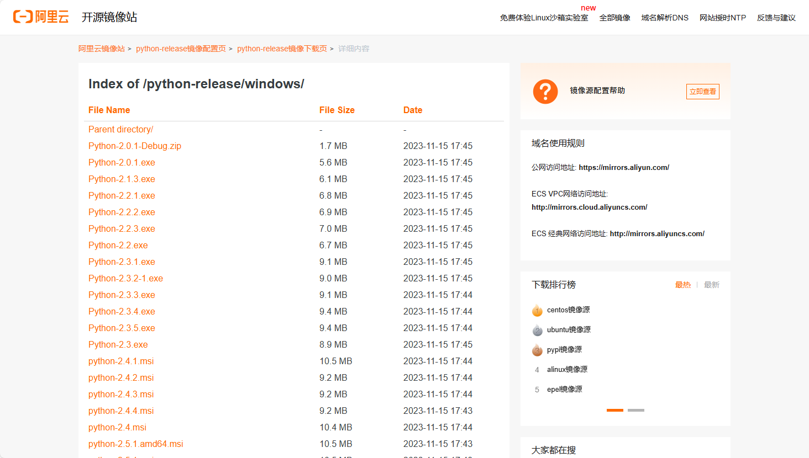
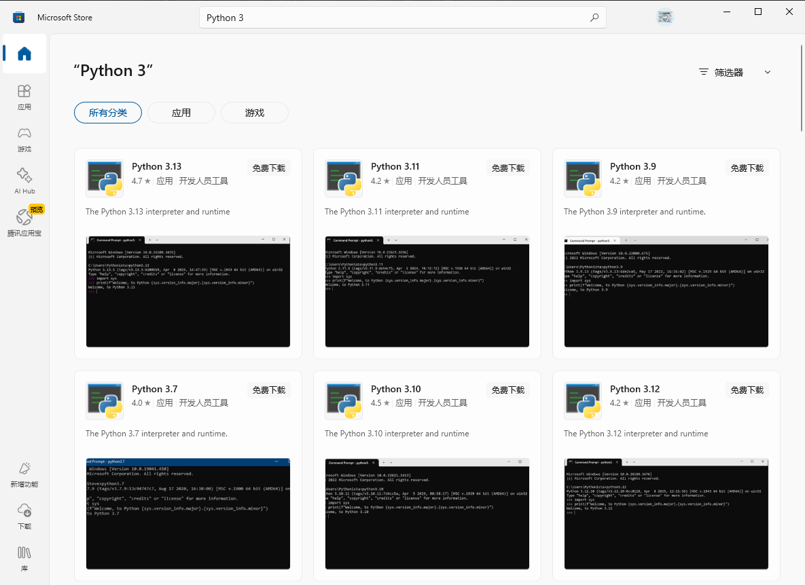
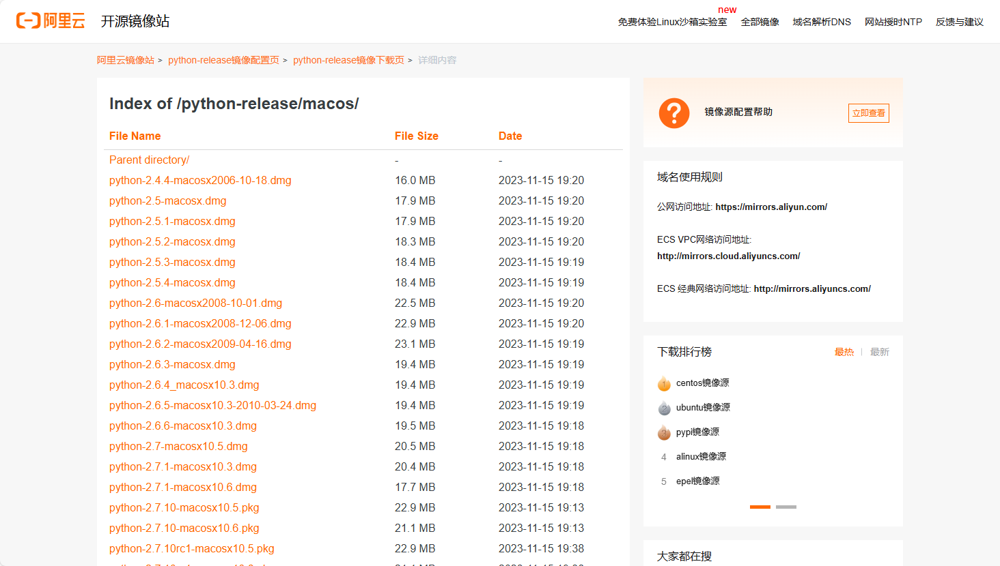

# Python 3 安装帮助

***Quarter OS 最低支持 Python 3.10 版本！***

***推荐使用 Python 3.12 及以上版本。***

## 对于 Windows 用户

**（最低支持Windows 8.1）**

### ① 前往 [Python 官网](https://www.python.org/downloads/) 或 [阿里云镜像源](https://mirrors.aliyun.com/python-release/) 下载 `exe` 或 `msi` 安装包。





下载完成后直接安装即可。

> 注意：安装界面中，请勾选 `Add Python 3.x to PATH` 选项。

---

### ② （对于 Windows 10/11 用户）通过`winget`命令安装：

``` powershell
# 查找Python版本
winget search Python.Python
# 比如要下载Python3.12
winget install --id Python.Python.3.12 --source winget --scope machine
```

### ③ （对于 Windows 10/11 用户）直接在Microsoft Store搜索 `Python 3` 安装。



## 对于 macOS 用户

**（最低支持 macOS 10.9 Mavericks）**

### ① 前往 [Python 官网](https://www.python.org/downloads/) 或 [阿里云镜像源](https://mirrors.aliyun.com/python-release/) 下载 `dmg` 安装包。




### ② 或者使用 Homebrew 安装 Python3：

``` bash
# 因为macOS内置Python2，所以这里要安装"python3"
brew install python3
```

## 对于 Linux 用户

**（最低支持 glibc 2.17，若低于该版本需自行编译Python3）**

### 请根据您的发行版的包管理器安装 Python3：

### Debian/Ubuntu：

**（最低支持：Debian 10 Buster、Ubuntu 20.04 LTS Focal）**

``` bash
sudo apt-get install python3
```

### CentOS/Fedora：

**（最低支持：CentOS 8 Stream、Fedora 32）**

``` bash
sudo dnf install python3
```

Arch Linux：

**（最低支持：未知）**

``` bash
sudo pacman -S python3
```

***注意！***

因为有些Linux发行版中自带Python3，但通常**没有提供完整版**。

比如 **Ubuntu 24.04 LTS Noble** 自带Python 3.12.3，但没有pip、venv等工具。

所以，我们需要安装完整版的Python 3。

```bash
# 更新软件源
sudo apt-get update
sudo apt-get upgrade

# 安装Python 3 完整版，比如安装Python3.12完整版
sudo apt-get install python3.12-full

# 验证安装成功
python3.12 -v
```

------

<div align="center">

Written by [ElofHew](https://github.com/ElofHew).

&copy; 2025 [Oak Studio](https://t.me/oakstdcn). All rights reserved.

</div>
