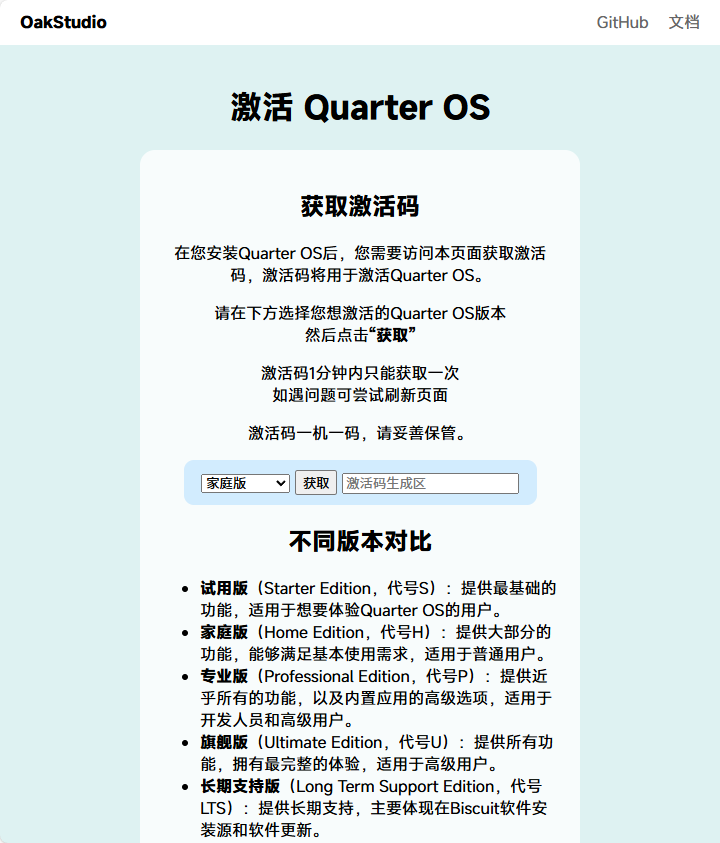

# 激活 Quarter OS

在您第一次启动 Quarter OS，进入OOBE的时候，会提示您激活Quarter OS。

虽然您可以在OOBE输入pass跳过激活，但未激活的情况下会有广告，并也将影响到部分功能和您的使用体验。

## 1. 获取激活码

您可以在Quarter OS官网的 [获取激活码页面](https://os.drevan.xyz/qos/activate/) 获取激活码。

### 不同版本说明

- **试用版**（Starter Edition，代号S）：提供最基础的功能，适用于想要体验Quarter OS的用户。

- **家庭版**（Home Edition，代号H）：提供大部分的功能，能够满足基本使用需求，适用于普通用户。

- **专业版**（Professional Edition，代号P）：提供近乎所有的功能，以及内置应用的高级选项，适用于开发人员和高级用户。

- **旗舰版**（Ultimate Edition，代号U）：提供所有功能，拥有最完整的体验，适用于高级用户。

- **长期支持版**（Long Term Support Edition，代号LTS）：提供长期支持，主要体现在Biscuit软件安装源和软件更新。

## 2. 输入激活码

在OOBE中，直接输入激活码并回车，即可完成激活。

若是在终端下，只需要输入 `activate -a <激活码>` 命令，回车即可完成激活。

## 3.检验激活状态

在KomShell中，输入 `activate -ck` 命令，即可查看当前激活状态。

## 4.激活作用

激活Quarter OS后，您将拥有以下功能：

- 在线更新 Quarter OS
- 关闭 Quarter OS 在线广告
- 完整体验 Biscuit 软件包管理器
- 享用更个性化的设置权限
- ……

---

Written by [ElofHew](https://github.com/ElofHew)

&copy; 2025 [Oak Studio](https://os.drevan.xyz/). All rights reserved.

